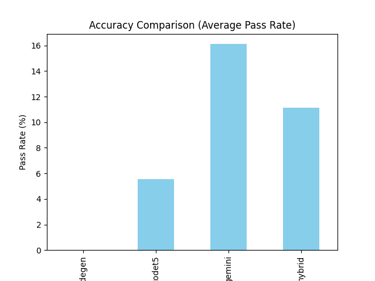
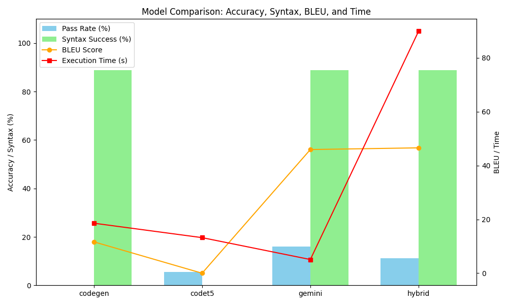
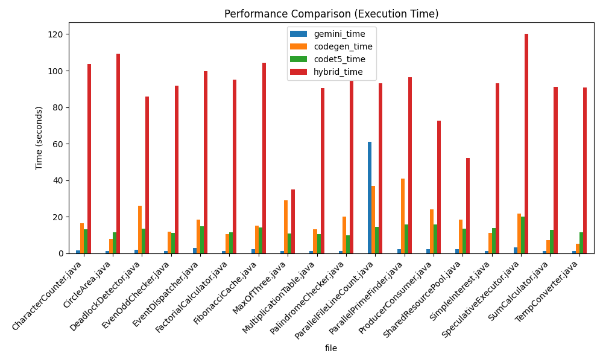
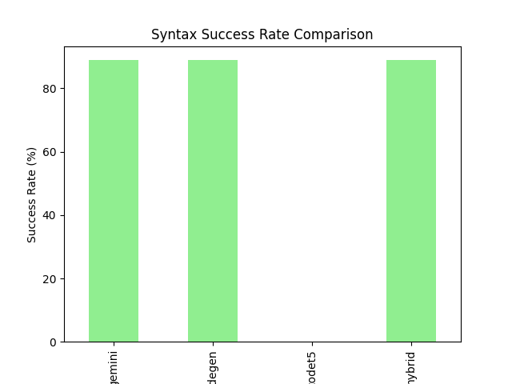

# Comparative Analysis of Programming Language Conversion Using Transformer-Based Models (Java → Python)

Author: Prashant Sharma

Degree: M.Sc. Computer Science   

Project Type: Research Dissertation 

Focus Area: AI-Based Code Translation & Evaluation

# 📌 Project Overview

This project presents a comparative study of transformer-based models for automated Java → Python code translation.
It introduces a fully automated evaluation testbed and proposes a Hybrid Transformer Model to improve translation accuracy, syntax correctness, and logical reliability.

The study evaluates multiple pre-trained models under uniform test conditions to identify the most effective approach for cross-language code conversion.

# ❓ Problem Statement

Software modernization and platform migration demand accurate code conversion

Manual rewriting is:

❌ Time-consuming

❌ Error-prone

❌ Expensive

Traditional conversion tools fail on:

Complex logic

Large programs

Edge cases

Transformer-based models show promise but:

Sometimes generate incorrect or non-executable code

Lack clear comparative evaluation

# 🎯 Objectives

Develop an automated testbed to fairly evaluate transformer models

Compare models across:

Accuracy

Syntax correctness

Execution success

Performance (latency)

Design a Hybrid Transformer Model to improve translation quality

Identify the best-performing model for Java → Python conversion

# 🤖 Models Evaluated

| Model            | Strengths                       | Limitations              |
| ---------------- | ------------------------------- | ------------------------ |
| **CodeT5**       | Strong semantic understanding   | Poor syntax accuracy     |
| **CodeGen**      | Fast generation                 | Weak logical correctness |
| **Gemini**       | High accuracy, strong reasoning | Cloud dependency         |
| **Hybrid Model** | Best logical clarity            | High execution time      |

# 🧠 Hybrid Model Architecture (CodeT5 + StarCoder)
🔹 Stage 1 – Code Analysis (CodeT5)

Generates a natural-language explanation of Java code

Captures:

Program intent

Conditions

Expected behavior

Acts as an intermediate logical representation

🔹 Stage 2 – Code Translation (StarCoder)

Uses:

Original Java code

Generated explanation

Produces logically improved Python code

🔹 Post-Processing

Removes:

Markdown

Extra comments

Descriptive text

Outputs clean, executable Python code

# 🏗️ System Architecture
├── input_programs

├── models

├── translated

├── references

├── evaluators

├── results

└── main.py

# 🛠️ Implementation Tools & Technologies

Python – Core automation & execution

Hugging Face Transformers – CodeT5, CodeGen, StarCoder

Gemini API – Cloud-based translation

JSON – Logs, metrics, structured outputs

Validators – Syntax checking

Matplotlib – Performance visualization

GitHub & PyCharm – Development & version control

# 🧪 Evaluation Metrics

BLEU Score – Translation quality

Syntax Success Rate – Executable correctness

Accuracy (Pass Rate) – Functional correctness

Execution Time – Performance efficiency

# 📊 Results & Comparison (Key Findings)
🔹 Accuracy & Syntax

Gemini leads in: Accuracy, Syntax correctness, Execution reliability

Hybrid Model performs well but is slow

CodeT5 fails in syntax generation

CodeGen produces syntactically valid but semantically weak code

🔹 Performance Summary

| Model   | Accuracy (%) | Syntax (%) | BLEU      | Time (s) |
| ------- | ------------ | ---------- | --------- | -------- |
| Gemini  | **16.11**    | **88.88**  | **45.93** | **5.08** |
| Hybrid  | 11.11        | 88.88      | 46.56     | 89.93    |
| CodeGen | 0.00         | 88.88      | 11.66     | 18.57    |
| CodeT5  | 0.00         | 0.00       | 0.00      | 13.21    |

# ✅ Conclusion

Built a fully automated Java → Python translation testbed

Conducted fair and systematic evaluation of transformer models

Demonstrated that:

Gemini performs best overall

Hybrid Model improves logical accuracy without retraining

The testbed is:

Reusable

Extendable

Suitable for future research

# 🔮 Future Work

Fine-tuning models on Java–Python datasets

Multi-language code translation support

Advanced metrics:

CodeBLEU

AST similarity

Enhanced hybrid reasoning pipelines

Web-based UI for:

Upload

Translate

Visualize

Standardized benchmark datasets

Smarter test-case generation using LLMs & symbolic execution